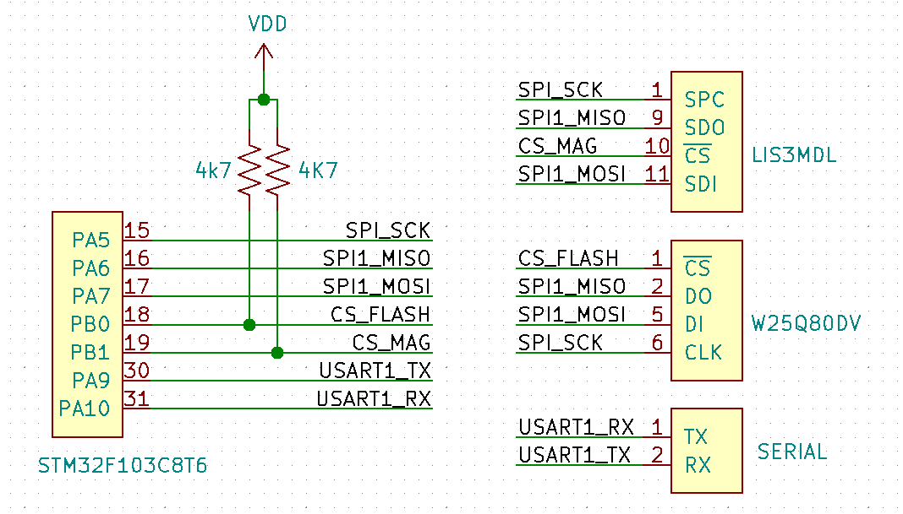

Test
=================

Description
------------------------------
Using a STM32F103, this test reads magnetometer and temperature values from the 
LIS3MDL and stores every second in the FLASH memory W25Q80DV, assigning a unique 
ID on each value. In case a message is received from the UART1 and it matches 
with any of the IDs stored in the memory, the MCU will transmit via UART1 the 
data, otherwise it will give an error.

Languages: `C`

TAG's: `tag:ARM`,`tag:STM32`, `tag:DRIVER`, `tag:FreeRTOS`, `tag:CMSIS-RTOS`, `tag:W25Q80DV`, `tag:LIS3MDL`

Hardware connection between ICs
------------------------------

Dependencies
------------

&mdash; STM32CubeIDE v1.5.0 o greater.

Repository structure
------------------------------

* **/stm32/stm32.ioc** &mdash; STM32CubeIDE configuration file.
* **/stm32/Core** &mdash; Core functions, initializations, ISRs based on application.
* **/stm32/Drivers** &mdash; Drivers needed by the core functions.
* **/stm32/Middlewares** &mdash; FreeRTOS source code, with the addition of the CMSIS-RTOS API.
* **/stm32/Documentation** &mdash; Doxygen code documentation.
